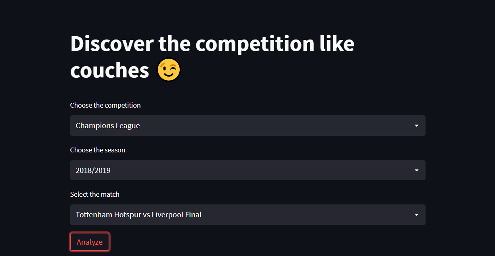
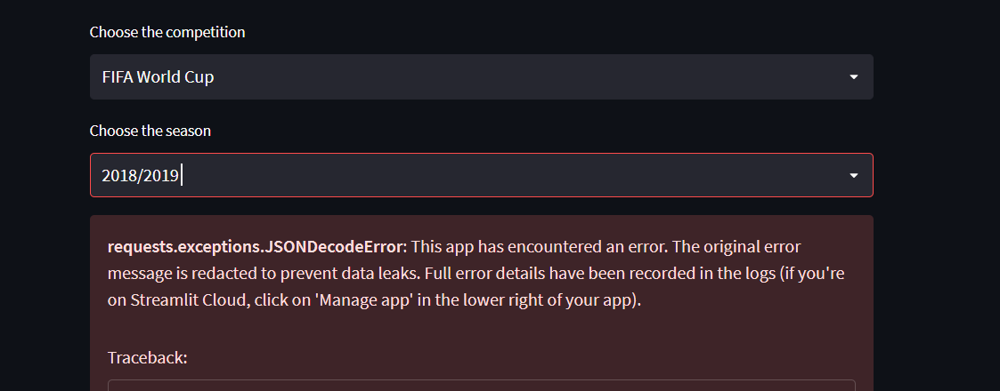
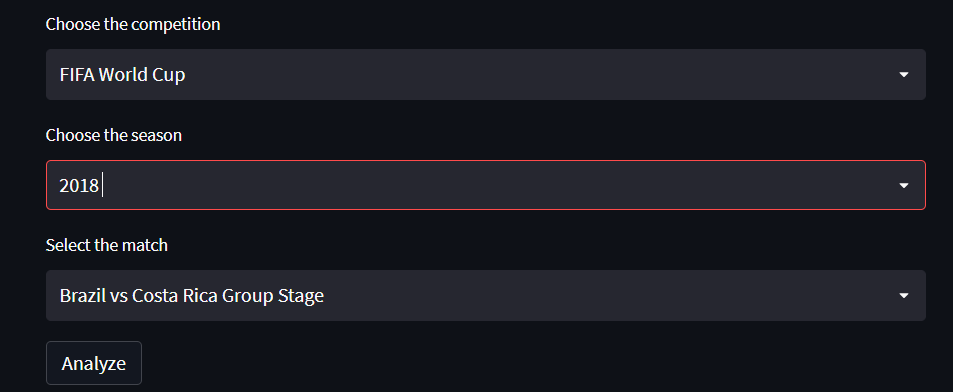

# Soccer analytics app
 A simple app for analyzing open data from statsbomb
 
 

          
    

    

**To open the app click [here](https://ahmedtarek26-soccer-analytics-statsbomby-statsbomb-yg8yfu.streamlitapp.com/)**

First you can choose the competition you want to analyize, the season then the match then click on the button 

the app will provide match stats like shots , dribbles , carrys for each player , fouls , interceptions, dispossessed, miscontrols and so on

Be careful  when you choose the season name find the right season name to avoid any error

and here it's after choosing the right season name

