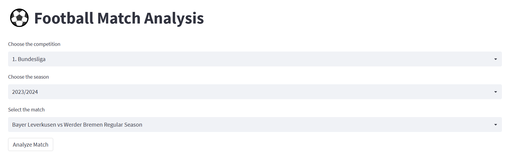

# Soccer analytics app
 A simple app for analyzing open data from statsbomb
 
 **To open the app click [here](https://ahmedtarek26-soccer-analytics-statsbomby-statsbomb-yg8yfu.streamlitapp.com/)**

 
 

          
    

    

First you can choose the competition you want to analyize, the season then the match then click on the button 

The app will provide match stats like shots , dribbles , pass networks ,  carrys for each player , fouls , interceptions, dispossessed, miscontrols and so on
